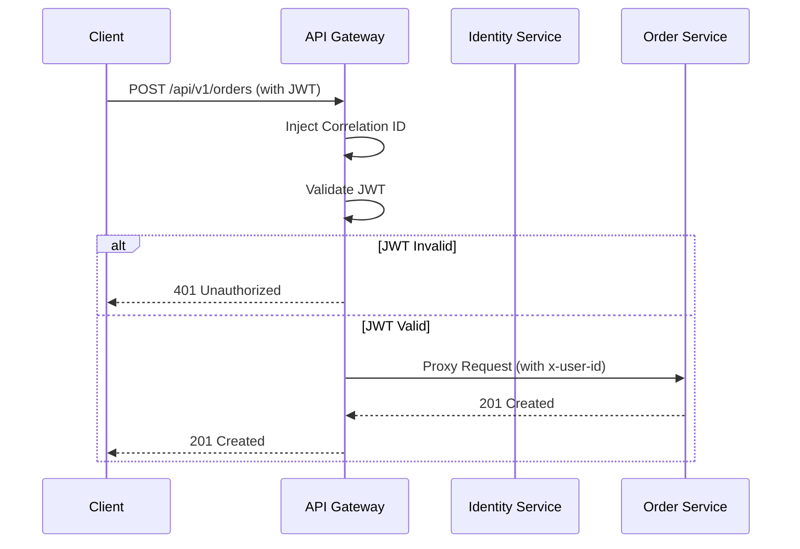

# EventSphere: API Gateway Architecture Design

The API Gateway is the central entry point for all external traffic. It replaces generic NGINX logic with a custom Express-based orchestrator that centralizes security, identity, and observability before forwarding requests to internal microservices.

---

## 1. Core Responsibilities

1.  **Reverse Proxy**: Forwarding `/api/v1/orders` to `order-service`, etc.
2.  **Centralized Authentication**: Validating JWT tokens from the Identity Service for all protected routes.
3.  **Correlation ID Injection**: Ensuring every request has an `x-correlation-id` before it hits the cluster.
4.  **Rate Limiting**: Preventing brute-force or denial-of-service attacks.
5.  **Request Logging**: Capturing ingress/egress metrics for observability.

---

## 2. Route Mapping

| Path Prefix | Destination Service | Auth Required |
| :--- | :--- | :--- |
| `/api/v1/auth` | `identity-service:8081` | No |
| `/api/v1/catalog` | `catalog-service:8082` | No (Read) / Yes (Write) |
| `/api/v1/seats` | `seating-service:8083` | Yes |
| `/api/v1/orders` | `order-service:8085` | Yes |
| `/api/v1/payments` | `payment-service:8084` | Yes |
| `/api/v1/tickets` | `ticket-service:8086` | Yes |
| `/api/v1/notifications` | `notification-service:8087` | Yes |

---

## 3. Middleware Stack

1.  **Correlation ID Middleware**: Generate/propagate `x-correlation-id`.
2.  **Standard Security**: `helmet`, `cors`.
3.  **Logging**: `httpLogger` from `@eventsphere/common`.
4.  **Auth (JWT)**: Custom middleware to verify `Authorization: Bearer <token>`.
5.  **Proxy**: `http-proxy-middleware` for efficient request forwarding.

---

## 4. Implementation Details

- **Tech Stack**: Node.js, TypeScript, Express, http-proxy-middleware.
- **Port**: 8080 (Ingress Port).
- **Graceful Shutdown**: Close proxy connections and loggers.

---

## 5. Sequence Diagram (Authenticated Request)



---

## 6. Folder Structure

```text
/apps/api-gateway
├── src/
│   ├── middleware/          # Auth, Proxy, Rate-limit
│   ├── routes/              # Proxy configurations
│   ├── config/              # Service URLs
│   └── index.ts             # Entry point
├── Dockerfile
└── kubernetes/              # Manifests
```
