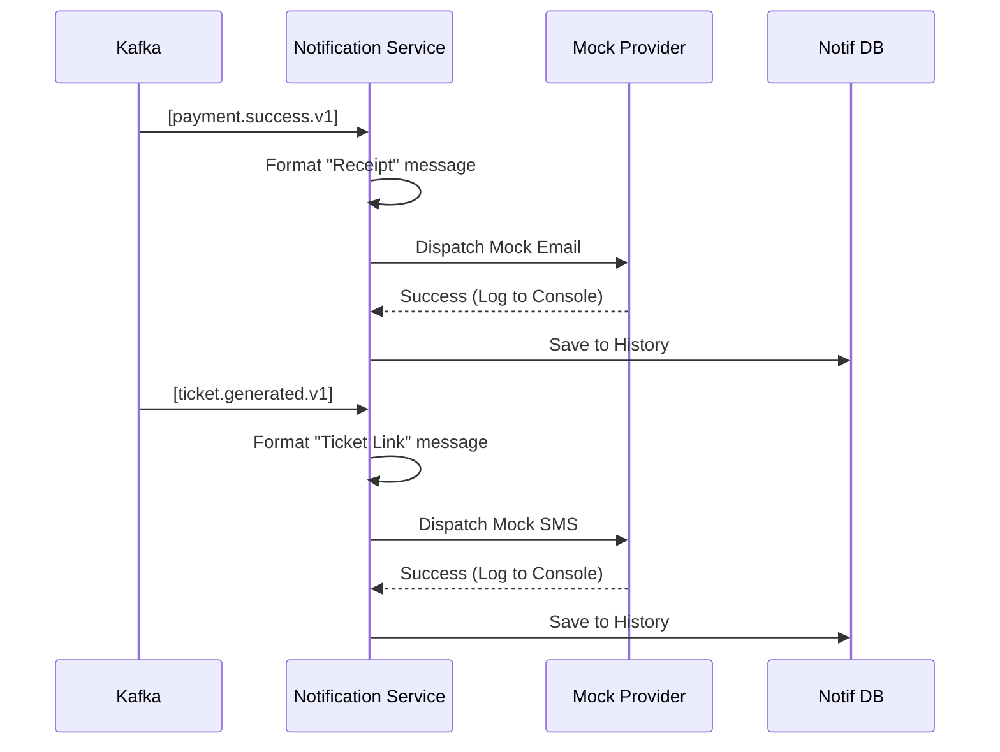

# EventSphere: Notification Service Architecture Design

The Notification Service is a reactive, cross-cutting service that provides "Mock" communication (Email/SMS) by consuming domain events from across the platform. It maintains a historical log of all simulated communications for audit and demonstration purposes.

---

## 1. Component Architecture

Following the **Clean Architecture** pattern:
- **Event Layer**: Multi-topic Kafka consumer (Payment, Order, Ticket).
- **Business Layer**: Dispatcher logic that formats messages based on event type.
- **Mock Layer**: Virtual adapters for Email and SMS that log to the console and persistence layer.
- **Transport Layer**: REST API for history retrieval.

---

## 2. Kafka Contracts (Consumed)

| Topic | Source | Message Intent |
| :--- | :--- | :--- |
| `payment.success.v1` | Payment Service | Send "Payment Received" receipt. |
| `order.confirmed.v1` | Order Service | Send "Order Confirmation" details. |
| `ticket.generated.v1` | Ticket Service | Send "Your Digital Tickets" with access links. |

---

## 3. API Contracts (v1)

### **GET /api/v1/notifications/user/:userId**
Retrieves the communication history for a specific user.
- **Response (200)**:
  ```json
  {
    "success": true,
    "data": [
      {
        "id": "notif-1",
        "type": "EMAIL",
        "recipient": "user@example.com",
        "subject": "Order Confirmed",
        "content": "Your order #789 is ready...",
        "timestamp": "2024-03-08T17:31:38Z"
      }
    ]
  }
  ```

---

## 4. Database Schema Design (PostgreSQL)

**Model: `NotificationLog`**
- `id`: String (UUID)
- `userId`: Int
- `type`: Enum (EMAIL, SMS)
- `channel`: String (e.g., "SMTP-MOCK", "TWILIO-MOCK")
- `recipient`: String (Email address or Phone number)
- `subject`: String (Optional)
- `content`: Text (The formatted message)
- `eventId`: String (Reference to the triggering Kafka event)
- `createdAt`: DateTime

---

## 5. Folder Structure

```text
/apps/notification-service
├── src/
│   ├── controllers/         # History retrieval
│   ├── services/            # Dispatcher & Formatting logic
│   ├── repositories/        # Persistence
│   ├── events/              # Multi-topic Kafka Consumers
│   ├── providers/           # Mock Email/SMS adapters
│   └── index.ts             # Entry point
├── prisma/
│   └── schema.prisma        # PostgreSQL Schema
└── docs/infra/              # Architecture Docs
```

---

## 6. Sequence Diagram


