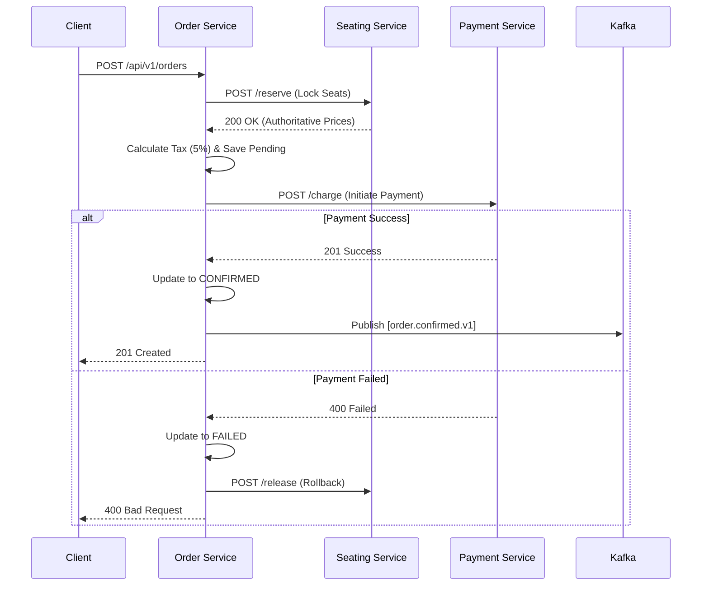

# EventSphere: Order Service Architecture Design

The Order Service acts as the central orchestrator for the "Buy Ticket" workflow, coordinating between Seating, Payment, and Ticket services using a combination of synchronous REST and asynchronous Kafka events.

---

## 1. Component Architecture

Following the **Clean Architecture** pattern:
- **Transport Layer**: Express controllers for order placement and status tracking.
- **Orchestration Layer**: Domain Service that manages the "Step-by-Step" reservation and payment flow.
- **Calculations Layer**: Specialized module for authoritative price aggregation and 5% tax calculation.
- **Data Access Layer**: Repositories for order persistence.

---

## 2. API Contracts (v1)

### **POST /api/v1/orders**
Initiates the ticketing saga.
- **Request Body**:
  ```json
  {
    "eventId": 123,
    "seatIds": [1, 2, 3],
    "userId": 456,
    "paymentMethod": "UPI"
  }
  ```
- **Success Response (201)**:
  ```json
  {
    "success": true,
    "data": {
      "orderId": 789,
      "status": "PENDING",
      "totalAmount": 1575.00,
      "expiryTime": "2024-03-08T17:31:38Z"
    }
  }
  ```

### **GET /api/v1/orders/:id**
Retrieves order status and item details.

### **POST /api/v1/orders/:id/cancel**
Manually cancels a pending order (releases seats).

---

## 3. Kafka Event Contracts

### **Produced Events**
| Topic | Payload | Description |
| :--- | :--- | :--- |
| `order.created.v1` | `{ orderId, eventId, seatIds, userId }` | Triggered when order record is first saved. |
| `order.confirmed.v1` | `{ orderId, userId, amount, seats: [] }` | Final success state, triggers ticketing. |
| `order.failed.v1` | `{ orderId, reason, correlationId }` | Final failure state, triggers seat release. |

### **Consumed Events**
| Topic | Source | Action |
| :--- | :--- | :--- |
| `payment.success.v1` | Payment Service | Move order to CONFIRMED. |
| `payment.failed.v1` | Payment Service | Move order to FAILED. |

---

## 4. Database Schema Design (PostgreSQL)

**Model: `Order`**
- `id`: Int (PK)
- `userId`: Int
- `eventId`: Int
- `subtotal`: Float (Sum of seat prices)
- `tax`: Float (5% of subtotal)
- `total`: Float (subtotal + tax)
- `status`: Enum (PENDING, CONFIRMED, FAILED, CANCELLED)
- `expiresAt`: DateTime (Order creation + 15m)
- `createdAt`: DateTime
- `items`: Relation[OrderItem]

**Model: `OrderItem`**
- `id`: Int (PK)
- `orderId`: Int (FK)
- `seatId`: Int
- `price`: Float (Authoritative price at time of order)

---

## 5. Orchestration Flow (Saga Step-by-Step)

1.  **Validation**: Verify user and event exist.
2.  **Seat Hold**: Synchronous call to `seating-service/reserve`.
3.  **Pricing**: Fetch authoritative seat prices from Seating Service.
4.  **Tax Logic**: Apply `(subtotal * 0.05)` tax.
5.  **Persistence**: Save Order as `PENDING`.
6.  **Payment**: Call `payment-service/charge` (Idempotent).
7.  **Finalize**: If Payment Success -> Mark `CONFIRMED` -> Emit `order.confirmed.v1`.

---

## 6. Folder Structure

```text
/apps/order-service
├── src/
│   ├── controllers/         # API endpoints
│   ├── services/            # Saga & Business Logic
│   ├── calculations/        # Tax & Pricing logic
│   ├── repositories/        # Prisma access
│   ├── events/              # Kafka Consumers/Producers
│   ├── dto/                 # Validation schemas
│   └── index.ts             # Entry point
├── prisma/
│   └── schema.prisma        # PostgreSQL Schema
└── docs/infra/              # Architecture Docs
```

---

## 7. Sequence Diagram


