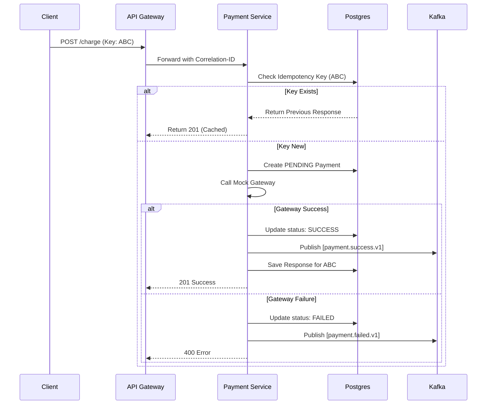

# EventSphere: Payment Service Architecture Design

The Payment Service is responsible for managing the financial lifecycle of orders, ensuring safe, idempotent transactions across the platform.

---

## 1. Component Architecture

Following the **Clean Architecture** pattern, the service is divided into:
- **Transport Layer**: Express.js controllers handling HTTP requests and Kafka consumers for domain events.
- **Business Logic Layer**: Domain services managing payment state transitions, business rules, and saga-specific logic.
- **Data Access Layer**: Repositories using Prisma ORM for PostgreSQL and a dedicated Idempotency Repository.
- **Infrastructure Layer**: Clients for Kafka, Redis (for idempotency caching), and OpenTelemetry.

---

## 2. Folder Structure

```text
/apps/payment-service
├── src/
│   ├── controllers/         # HTTP Route Handlers
│   ├── services/            # Business Logic & State Transitions
│   ├── repositories/        # Database Access (Prisma)
│   ├── events/              # Kafka Producers & Consumers
│   ├── middleware/          # Idempotency & Auth Middleware
│   ├── dto/                 # Request/Response Data Transfer Objects
│   ├── config/              # Env & Client Configs
│   ├── index.ts             # Entry Point
│   └── server.ts            # Express App Setup
├── prisma/
│   └── schema.prisma        # Database Schema
├── Dockerfile
└── package.json
```

---

## 3. API Contracts (v1)

### **POST /api/v1/payments/charge**
Initiates a payment for an order. Requires `Idempotency-Key` header.
- **Request Header**: `Idempotency-Key: <unique-uuid>`
- **Request Body**:
  ```json
  {
    "orderId": 123,
    "amount": 1574.21,
    "currency": "INR",
    "paymentMethod": "UPI"
  }
  ```
- **Success Response (201)**:
  ```json
  {
    "success": true,
    "data": { "paymentId": 456, "status": "SUCCESS", "transactionId": "TXN_789" }
  }
  ```

### **POST /api/v1/payments/refund**
Processes a refund for a previously successful payment.
- **Request Body**:
  ```json
  {
    "paymentId": 456,
    "reason": "Event Cancelled"
  }
  ```
- **Success Response (200)**:
  ```json
  { "success": true, "data": { "status": "REFUNDED" } }
  ```

---

## 4. Kafka Event Contracts

### **Produced Events**
| Topic | Payload | Description |
| :--- | :--- | :--- |
| `payment.success.v1` | `{ paymentId, orderId, amount, correlationId }` | Payment confirmed by gateway. |
| `payment.failed.v1` | `{ orderId, reason, correlationId }` | Payment rejected or timed out. |
| `payment.refunded.v1` | `{ paymentId, orderId, amount }` | Refund successfully processed. |

---

## 5. Database Schema Design (PostgreSQL)

**Model: `Payment`**
- `id`: Int (PK)
- `orderId`: Int (Indexed)
- `amount`: Float
- `currency`: String (default: 'INR')
- `status`: Enum (PENDING, SUCCESS, FAILED, REFUNDED)
- `method`: String (UPI, CARD, WALLET)
- `transactionId`: String (Unique, Nullable)
- `idempotencyKey`: String (Unique)
- `createdAt`: DateTime
- `updatedAt`: DateTime

**Model: `IdempotencyRecord`**
- `key`: String (PK)
- `responseStatus`: Int
- `responseBody`: Json
- `expiresAt`: DateTime

---

## 6. Sequence Diagrams

### **Charge Workflow (Idempotent)**



---

## 7. Metrics Strategy

- `payments_total`: Counter (status: SUCCESS/FAILED).
- `payment_latency_seconds`: Histogram (gateway response time).
- `active_transactions`: Gauge.
- `idempotency_hits_total`: Counter.
