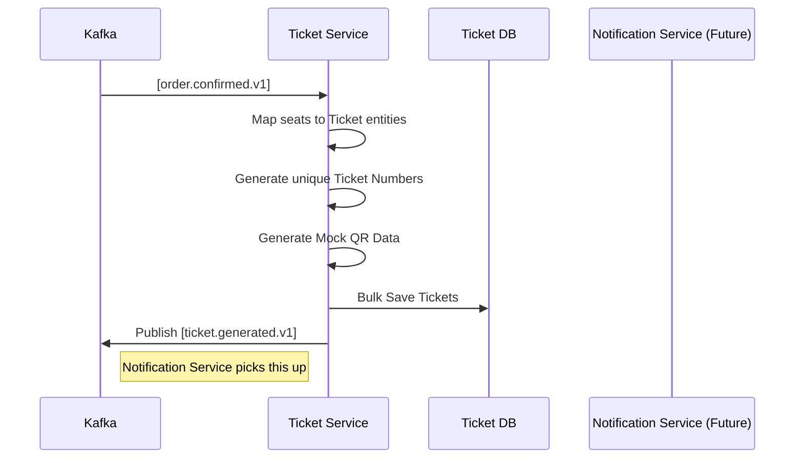

# EventSphere: Ticket Service Architecture Design

The Ticket Service is a reactive fulfillment service that generates digital tickets and access codes (QR codes) once an order is confirmed. It operates primarily as a Kafka consumer with a read-only REST API for ticket retrieval.

---

## 1. Component Architecture

Following the **Clean Architecture** pattern:
- **Event Layer**: Kafka consumer listening for `order.confirmed.v1`.
- **Business Layer**: Ticket generator service that creates unique ticket IDs and mock QR code strings.
- **Transport Layer**: Express controllers for ticket retrieval and validation.
- **Data Access Layer**: Repositories for ticket persistence.

---

## 2. API Contracts (v1)

### **GET /api/v1/tickets/:id**
Retrieves details for a specific ticket.
- **Response (200)**:
  ```json
  {
    "success": true,
    "data": {
      "ticketId": "TKT-12345",
      "orderId": 789,
      "seatId": 12,
      "qrCode": "QR_DATA_BASE64",
      "status": "VALID"
    }
  }
  ```

### **GET /api/v1/tickets/order/:orderId**
Retrieves all tickets associated with an order.
- **Response (200)**:
  ```json
  {
    "success": true,
    "data": [
      { "ticketId": "TKT-12345", "seatId": 12 },
      { "ticketId": "TKT-12346", "seatId": 13 }
    ]
  }
  ```

---

## 3. Kafka Event Contracts

### **Consumed Events**
| Topic | Source | Action |
| :--- | :--- | :--- |
| `order.confirmed.v1` | Order Service | Triggers generation of N tickets for the order. |

### **Produced Events**
| Topic | Payload | Description |
| :--- | :--- | :--- |
| `ticket.generated.v1` | `{ orderId, ticketIds: [] }` | Notifies the Notification Service to send emails. |

---

## 4. Database Schema Design (PostgreSQL)

**Model: `Ticket`**
- `id`: String (PK, UUID)
- `orderId`: Int
- `userId`: Int
- `eventId`: Int
- `seatId`: Int
- `ticketNumber`: String (Unique Human-Readable ID)
- `qrCode`: String (Text-based QR representation)
- `status`: Enum (VALID, USED, VOIDED)
- `createdAt`: DateTime

---

## 5. Folder Structure

```text
/apps/ticket-service
├── src/
│   ├── controllers/         # API endpoints
│   ├── services/            # Ticket generation logic
│   ├── repositories/        # Prisma access
│   ├── events/              # Kafka Consumers (Listener)
│   ├── utils/               # QR Code generators (Mock)
│   └── index.ts             # Entry point
├── prisma/
│   └── schema.prisma        # PostgreSQL Schema
└── docs/infra/              # Architecture Docs
```

---

## 6. Sequence Diagram


