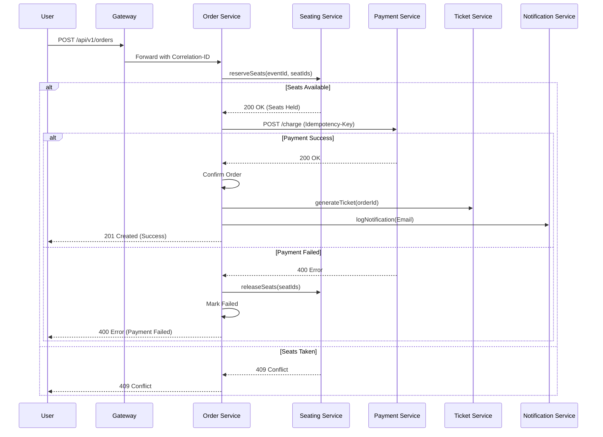

# EventSphere: Production-Grade Microservices Architecture Design

This document outlines the architectural blueprint for the EventSphere Event Ticketing & Seat Reservation platform.

---

## 1. Service Boundaries & Responsibilities

| Service | Responsibility |
| :--- | :--- |
| **API Gateway** | Entry point, JWT validation, Request routing, Correlation ID injection, Rate limiting. |
| **Identity Service** | User registration, Login, JWT issuance, Profile management. |
| **Catalog Service** | Venue and Event metadata management, Search, Filtering. |
| **Seating Service** | Seat inventory, Pricing (SSOT), Atomic reservations (Redis TTL), Concurrency control. |
| **Order Service** | Order lifecycle (Created, Confirmed, Cancelled), Tax calculation, Saga orchestration. |
| **Payment Service** | Payment processing, Refund handling, Idempotency tracking. |
| **Ticket Service** | Ticket generation, QR code generation, Ticket retrieval. |
| **Notification Service** | Mock service consuming Kafka events to log simulated Email/SMS notifications. |

---

## 2. API Design (v1)

### **Identity Service**
- `POST /api/v1/auth/register`: Create new user.
- `POST /api/v1/auth/login`: Authenticate and return JWT.
- `GET /api/v1/users/me`: Get current user profile.

### **Catalog Service**
- `GET /api/v1/events`: List events with filters (city, type, status).
- `GET /api/v1/events/:id`: Get event details.
- `POST /api/v1/admin/venues`: (Admin) Create venue.
- `POST /api/v1/admin/events`: (Admin) Create event.

### **Seating Service**
- `GET /api/v1/seats?eventId=...`: Get seat map and availability.
- `POST /api/v1/seats/reserve`: Internal/Admin - Atomic seat hold (15m TTL).
- `POST /api/v1/seats/release`: Internal/Admin - Release held seats.

### **Order Service**
- `POST /api/v1/orders`: Create order (requires `Idempotency-Key`).
- `GET /api/v1/orders/:id`: Get order status and details.
- `POST /api/v1/orders/:id/cancel`: Manual order cancellation.

### **Payment Service**
- `POST /api/v1/payments/charge`: Process payment (requires `Idempotency-Key`).
- `POST /api/v1/payments/refund`: Process refund.

---

## 3. Event Contracts (Kafka)

All events follow the envelope: `{ eventId, eventType, timestamp, correlationId, payload }`.

| Topic Name | Producer | Consumers | Description |
| :--- | :--- | :--- | :--- |
| `order.created.v1` | Order Service | Seating Service | Triggers seat reservation. |
| `seat.reserved.v1` | Seating Service | Order Service | Seat hold successful, proceed to payment. |
| `seat.failed.v1` | Seating Service | Order Service | Seat unavailable, fail order. |
| `payment.success.v1` | Payment Service | Order Service, Notification | Payment successful, confirm order. |
| `payment.failed.v1` | Payment Service | Order Service, Seating | Payment failed, release seats. |
| `order.confirmed.v1` | Order Service | Ticket Service, Notification | Order final, generate ticket. |
| `ticket.generated.v1` | Ticket Service | Notification | Ticket ready for delivery. |

---

## 4. Database Ownership (PostgreSQL)

- **identity_db**: `users` (id, email, password_hash, role, profile).
- **catalog_db**: `venues` (id, name, location), `events` (id, venue_id, title, date, status).
- **seating_db**: `seats` (id, event_id, section, row, number, price, status), `reservations` (id, seat_id, order_id, expires_at).
- **order_db**: `orders` (id, user_id, event_id, total_price, status, idempotency_key).
- **payment_db**: `payments` (id, order_id, amount, status, transaction_id, idempotency_key).
- **ticket_db**: `tickets` (id, order_id, seat_id, qr_code_data).

---

## 5. Sequence Diagram: Buy Ticket Flow (Choreographed Saga)



---

## 6. Deployment Architecture

### **Docker Compose (Local)**
- One container per microservice.
- Infrastructure: `postgres:15`, `redis:7`, `confluentinc/cp-kafka:latest`.
- Observability: `prometheus`, `grafana`, `loki`, `promtail`.

### **Kubernetes (Minikube)**
- **Ingress**: NGINX Ingress Controller.
- **Service Mesh**: Custom Express Gateway handles internal routing.
- **Persistence**: `PersistentVolumeClaims` for PostgreSQL and Redis.
- **Scalability**: `HorizontalPodAutoscaler` based on CPU/Memory metrics.

---

## 7. Folder Structure (Monorepo)

```text
/eventsphere
├── apps/
│   ├── api-gateway/
│   ├── identity-service/
│   ├── catalog-service/
│   ├── seating-service/
│   ├── order-service/
│   ├── payment-service/
│   ├── ticket-service/
│   └── notification-service/
├── packages/
│   ├── contracts/ (Shared TS interfaces)
│   ├── common/ (Logging, Tracing, Middleware)
├── infra/
│   ├── docker/
│   └── k8s/
└── dataset/ (CSV files for seeding)
```

---

## 8. Logging Standard

**Format**: Structured JSON via `pino`.

```json
{
  "timestamp": "2026-05-02T12:00:00.000Z",
  "level": "info",
  "service": "order-service",
  "correlationId": "uuid-123",
  "traceId": "otel-trace-abc",
  "event": "ORDER_CREATED",
  "payload": { "orderId": "ord-456", "userId": "user-789" },
  "message": "Order successfully created"
}
```

---

## 9. Metrics Strategy (Prometheus)

- **Throughput**: `http_requests_total` (by method, path, status).
- **Latency**: `http_request_duration_seconds` (histogram).
- **Business**:
    - `orders_total`: Counter for confirmed orders.
    - `seat_reservations_failed`: Counter for concurrent booking failures.
    - `payments_failed_total`: Counter for transaction failures.
- **Health**: `/health`, `/ready`, `/live` endpoints.

---

## 10. Security Approach

1.  **Authentication**: Identity Service issues JWTs (RS256 signed).
2.  **Authorization**: Gateway validates JWT; Roles (Admin/User) checked at Service level.
3.  **Data at Rest**: PostgreSQL passwords hashed with `bcrypt` (12 rounds).
4.  **Data in Transit**: HTTPS/TLS for all external communication.
5.  **Secrets Management**: K8s Secrets for DB credentials and Kafka tokens.
6.  **Idempotency**: `Idempotency-Key` checked against Redis before processing Orders/Payments.
