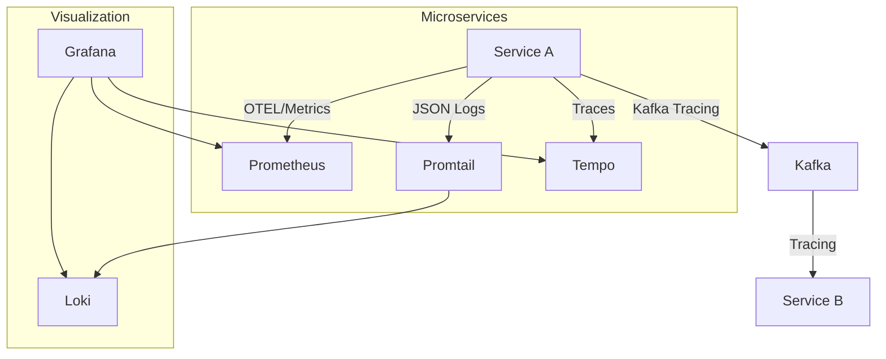

# EventSphere: Observability Architecture Design

The EventSphere platform implements a "Three Pillars" observability strategy tailored for distributed event-driven systems, using the **LGTM Stack** (Loki, Grafana, Tempo/Tracing, Prometheus).

---

## 1. Metrics Strategy (Prometheus)

We track **RED Metrics** (Rate, Errors, Duration) and **Golden Signals** (Latency, Traffic, Errors, Saturation).
- **HTTP Metrics**: Inbound request rates, error codes (4xx/5xx), and 95th/99th percentile latency.
- **Kafka Metrics**: Producer/Consumer lag and message throughput.
- **Business Metrics**: Order saga completion rates and rollback counts.

---

## 2. Logging Strategy (Loki + Promtail)

Every service emits **Structured JSON Logs** to `stdout`.
- **Labels**: `service`, `env`, `namespace`.
- **Mandatory Fields**: 
    - `timestamp`, `correlationId`, `traceId`, `spanId`.
    - `eventType`, `latency`, `statusCode`, `path`.
- **Aggregator**: Promtail (K8s DaemonSet) scrapes logs and pushes to Loki.

---

## 3. Tracing Strategy (OpenTelemetry)

Distributed tracing is implemented via **OpenTelemetry (OTEL)**.
- **Propagation**: `W3C Trace Context` headers are propagated through:
    1.  **HTTP**: API Gateway -> Services.
    2.  **Kafka**: Trace context injected into Kafka message headers during saga events.
- **Backend**: Grafana Tempo (or Loki with TraceID lookup).

---

## 4. Correlation Propagation

A unified **Correlation ID (`x-correlation-id`)** is generated at the API Gateway and propagated:
1.  **Incoming Request**: Injected into `pino` logger context.
2.  **Service-to-Service**: Passed via Axios headers.
3.  **Kafka Event**: Embedded in the `EventEnvelope` and Kafka record headers.
4.  **Response**: Returned to the client in the `X-Correlation-ID` header.

---

## 5. Dashboard Strategy (Grafana)

- **System Health**: Overview of all 8 microservices (CPU/Memory/Uptime).
- **Traffic Dashboard**: Gateway ingress rates and error distributions.
- **Saga Dashboard**: Visualizing the lifecycle of an order from Seating to Ticket generation.

---

## 6. Observability Component Diagram

